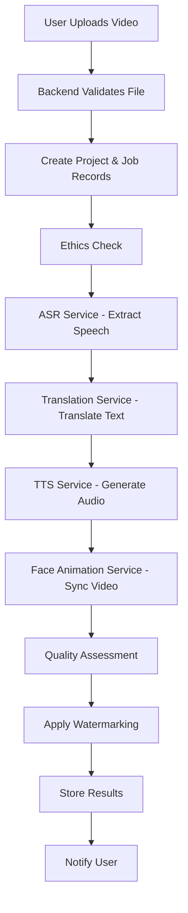
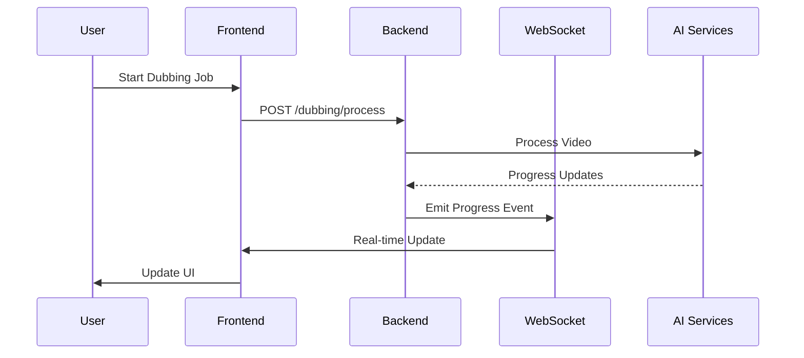

# System Architecture Overview

## Introduction

The Multilingual AI Video Dubbing Platform is designed as a microservices architecture that delivers high-fidelity multilingual dubbing with realistic facial animations. This document provides a comprehensive overview of the system architecture, components, and data flow.

## High-Level Architecture

```
┌─────────────────┐    ┌─────────────────┐    ┌─────────────────┐
│   Frontend UI   │    │   Backend API   │    │  AI Services    │
│   (React)       │◄──►│   (FastAPI)     │◄──►│  (Microservices)│
└─────────────────┘    └─────────────────┘    └─────────────────┘
                                │
                                ▼
                       ┌─────────────────┐
                       │   Database      │
                       │   (PostgreSQL)  │
                       └─────────────────┘
```

## Core Components

### 1. Frontend Application (React)
- **Technology**: React 18, TypeScript, Tailwind CSS
- **Purpose**: User interface for video upload, configuration, and monitoring
- **Key Features**:
  - Drag-and-drop video upload
  - Real-time progress tracking
  - Language selection interface
  - Quality metrics dashboard
  - Project management

### 2. Backend API (FastAPI)
- **Technology**: FastAPI, Python 3.11, SQLAlchemy
- **Purpose**: Main application logic, user management, job orchestration
- **Key Features**:
  - RESTful API endpoints
  - JWT authentication
  - File upload handling
  - Job queue management
  - Ethics and compliance tracking

### 3. AI Services (Microservices)
Four specialized AI services handle the core dubbing pipeline:

#### ASR Service (Port 8001)
- **Technology**: Whisper Large-v3, PyTorch
- **Purpose**: Automatic Speech Recognition
- **Features**:
  - Multi-language speech recognition
  - Speaker segmentation
  - Confidence scoring
  - Real-time transcription

#### Translation Service (Port 8002)
- **Technology**: SeamlessM4T, Transformers
- **Purpose**: Multilingual text translation
- **Features**:
  - 50+ language support
  - Context-aware translation
  - BLEU score calculation
  - Batch processing

#### TTS Service (Port 8003)
- **Technology**: VITS, YourTTS, Coqui TTS
- **Purpose**: Text-to-Speech with voice cloning
- **Features**:
  - Voice cloning from samples
  - Emotion-aware synthesis
  - Multi-speaker support
  - Quality assessment

#### Face Animation Service (Port 8004)
- **Technology**: FLAME, MediaPipe, DAE-Talker
- **Purpose**: Facial re-animation and lip-sync
- **Features**:
  - 3D face reconstruction
  - Audio-to-expression mapping
  - Neural rendering
  - Quality metrics (LSE-C, FID)

### 4. Database Layer
- **Primary Database**: PostgreSQL 15
- **Purpose**: Persistent data storage
- **Schema**:
  - Users and authentication
  - Projects and jobs
  - Media files and metadata
  - Ethics and compliance records
  - Quality metrics and analytics

### 5. Caching and Queue Layer
- **Technology**: Redis 7
- **Purpose**: Caching, session storage, task queuing
- **Usage**:
  - User session management
  - API response caching
  - Celery task queue
  - Real-time job status

### 6. Infrastructure Components

#### Reverse Proxy (Nginx)
- Load balancing
- SSL termination
- Static file serving
- Rate limiting

#### Monitoring Stack
- **Prometheus**: Metrics collection
- **Grafana**: Dashboards and visualization
- **Structured Logging**: JSON logs with correlation IDs

## Data Flow

### 1. Video Upload and Processing Pipeline



### 2. Real-time Progress Updates



## Quality Assurance Pipeline

### Quality Metrics (Per PRD Requirements)

| Metric | Target | Tool | Purpose |
|--------|--------|------|---------|
| LSE-C | ≥ 0.85 | SyncNet | Lip-sync accuracy |
| FID | ≤ 15 | Fréchet Inception Distance | Visual fidelity |
| AU Correlation | ≥ 0.75 | OpenFace AUs | Emotion preservation |
| BLEU | ≥ 35 | SacreBLEU | Translation quality |

### Quality Assessment Flow

1. **Real-time Monitoring**: Each AI service reports quality metrics
2. **Threshold Checking**: Compare against PRD targets
3. **Automatic Retry**: Failed jobs retry with different parameters
4. **Human Review**: Optional manual quality review
5. **Final Validation**: End-to-end quality assessment

## Ethical AI Implementation

### 1. Consent Management
- **Database**: Consent records with expiration tracking
- **Workflow**: Pre-processing consent verification
- **Compliance**: GDPR, CCPA, and local privacy laws

### 2. Digital Watermarking
- **Technology**: Imperceptible noise-based signatures
- **Standards**: C2PA compliant watermarks
- **Detection**: Automated watermark verification

### 3. Provenance Tracking
- **Metadata**: Complete processing chain documentation
- **Signatures**: Cryptographic content verification
- **Audit Trail**: Immutable processing history

## Scalability and Performance

### Horizontal Scaling
- **Stateless Services**: All services can scale independently
- **Load Balancing**: Nginx distributes requests across instances
- **Database Sharding**: Partition data by user/project
- **CDN Integration**: Static content delivery optimization

### Resource Management
- **GPU Allocation**: Dynamic GPU assignment for AI services
- **Memory Management**: Efficient model loading and caching
- **Queue Management**: Priority-based job processing
- **Auto-scaling**: Container orchestration with Kubernetes

### Performance Targets
- **API Response**: < 200ms for standard endpoints
- **File Upload**: Support up to 500MB files
- **Processing Time**: < 1 minute per 1-minute video (target)
- **Concurrent Users**: 1000+ simultaneous users
- **Throughput**: 100+ videos per hour

## Security Architecture

### Authentication and Authorization
- **JWT Tokens**: Stateless authentication
- **Role-Based Access**: Admin, Creator, Reviewer, Viewer roles
- **API Rate Limiting**: Prevent abuse and ensure fair usage
- **Input Validation**: Comprehensive request validation

### Data Protection
- **Encryption at Rest**: Database and file storage encryption
- **Encryption in Transit**: TLS 1.3 for all communications
- **Secure File Upload**: Virus scanning and format validation
- **Data Retention**: Automatic cleanup of temporary files

### Network Security
- **Firewall Rules**: Restrict access to internal services
- **VPN Access**: Secure administrative access
- **DDoS Protection**: Rate limiting and traffic analysis
- **Security Headers**: HSTS, CSP, and other security headers

## Deployment Architecture

### Container Strategy
- **Docker Containers**: All services containerized
- **Multi-stage Builds**: Optimized image sizes
- **Health Checks**: Automated service health monitoring
- **Graceful Shutdown**: Proper cleanup on container stop

### Orchestration
- **Docker Compose**: Development and single-node deployment
- **Kubernetes**: Production multi-node deployment
- **Helm Charts**: Kubernetes application packaging
- **GitOps**: Automated deployment pipeline

### Environment Management
- **Development**: Local Docker Compose setup
- **Staging**: Kubernetes cluster with test data
- **Production**: Multi-region Kubernetes deployment
- **Configuration**: Environment-specific config management

## Monitoring and Observability

### Metrics Collection
- **Application Metrics**: Custom business metrics
- **System Metrics**: CPU, memory, disk, network
- **AI Model Metrics**: Inference time, accuracy, resource usage
- **User Experience**: Response times, error rates

### Logging Strategy
- **Structured Logging**: JSON format with correlation IDs
- **Centralized Logs**: ELK stack or similar
- **Log Levels**: Debug, Info, Warning, Error, Critical
- **Retention Policy**: 30 days for debug, 1 year for errors

### Alerting
- **Threshold Alerts**: Automated alerts for metric thresholds
- **Anomaly Detection**: ML-based anomaly detection
- **Escalation Policies**: Multi-tier alert escalation
- **Integration**: Slack, PagerDuty, email notifications

## Disaster Recovery

### Backup Strategy
- **Database Backups**: Daily full backups, hourly incrementals
- **File Storage**: Replicated across multiple regions
- **Configuration**: Version-controlled infrastructure as code
- **Recovery Testing**: Monthly disaster recovery drills

### High Availability
- **Multi-Region**: Active-passive deployment across regions
- **Load Balancing**: Health check-based traffic routing
- **Database Clustering**: PostgreSQL streaming replication
- **Failover**: Automated failover with manual override

## Future Architecture Considerations

### Planned Enhancements
- **Edge Computing**: Deploy AI services closer to users
- **Federated Learning**: Improve models without centralizing data
- **Real-time Streaming**: Live video dubbing capabilities
- **Mobile SDKs**: Native mobile application support

### Technology Evolution
- **Model Updates**: Seamless AI model version management
- **Hardware Optimization**: Support for new GPU architectures
- **Protocol Upgrades**: HTTP/3, WebRTC for real-time features
- **Standards Compliance**: Emerging AI ethics and safety standards

This architecture provides a robust, scalable, and ethical foundation for the Multilingual AI Video Dubbing Platform, meeting all requirements specified in the PRD while maintaining flexibility for future enhancements.